# Licence 

This work is licensed under the [Creative Commons Attribution-NonCommercial-NoDerivatives 4.0 International License (CC BY-NC-ND 4.0)](https://creativecommons.org/licenses/by-nc-nd/4.0/).

### Usage Terms

The license terms are negotiable. You are free to use this work for non-commercial purposes without profit. If you receive compensation or profit from its use, please consider supporting me through [GitHub Sponsors](https://github.com/sponsors/valzzu).

# Flushable

Both lora and ble has ipex ufl connector

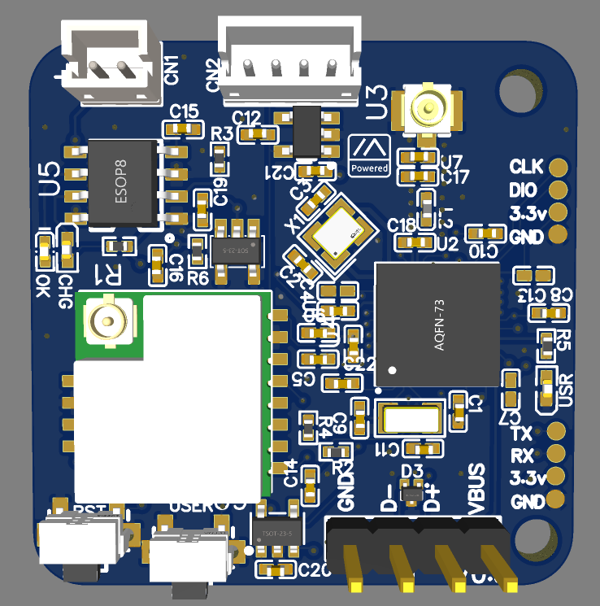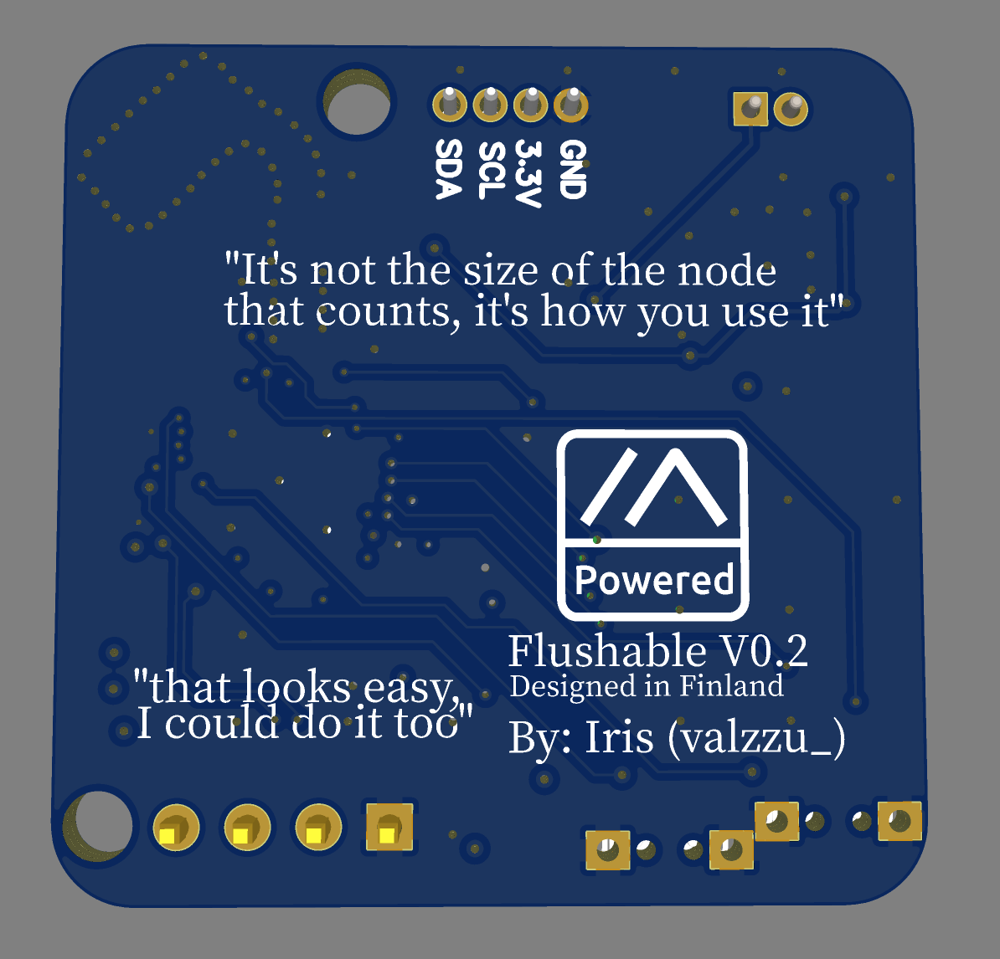
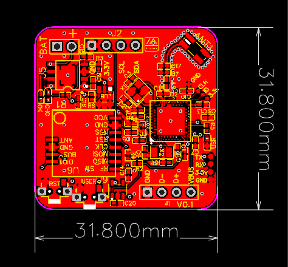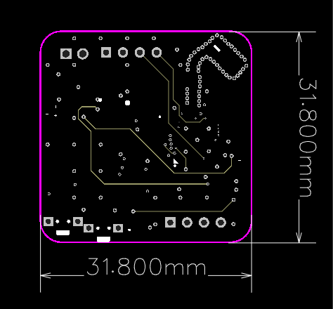
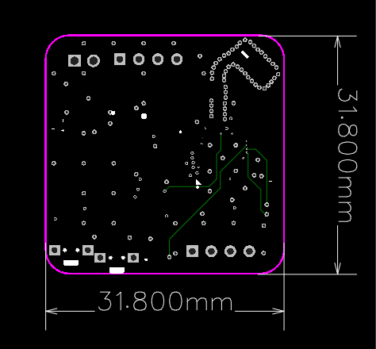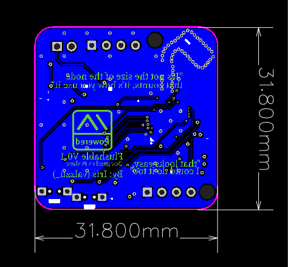

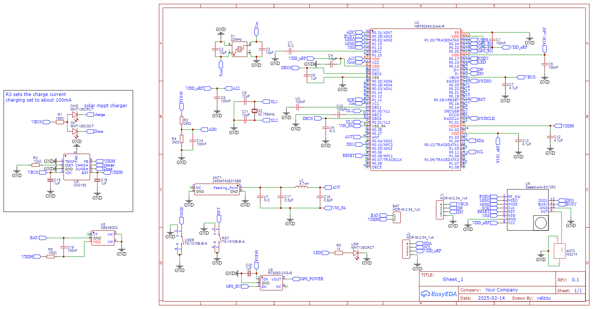

[Lora](https://www.seeedstudio.com/Wio-SX1262-Wireless-Module-p-5981.html)

[Gerber](./Gerber_nRF52-watch.zip)

[BOM](./BOM_nRF52-watch.csv)

[PnP](./PickAndPlace_nRF52-watch.csv)

## V0.4.X

> [!CAUTION]
> V0.4 has not been tested yet so no quarantee everything works

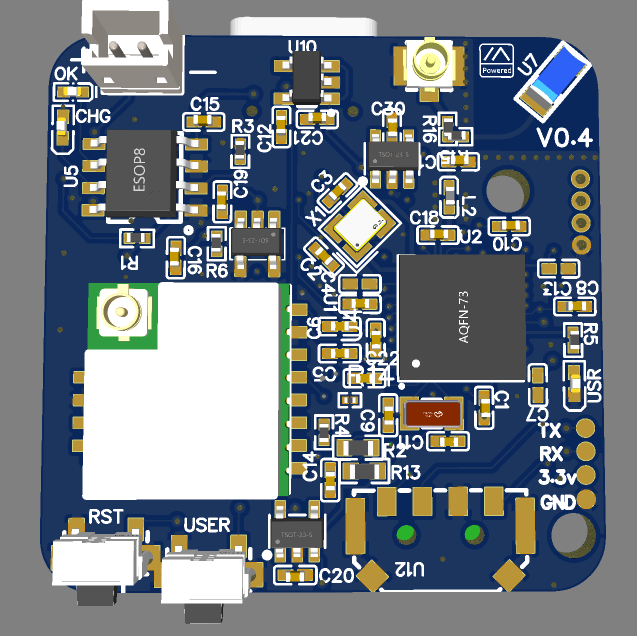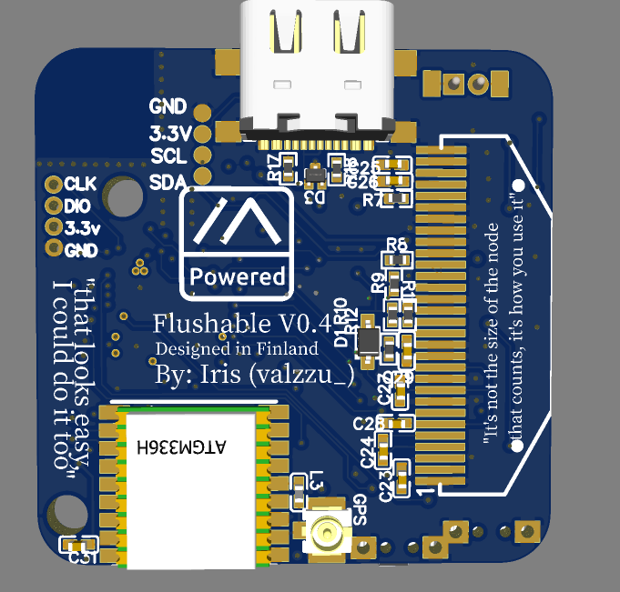
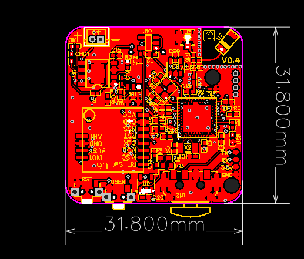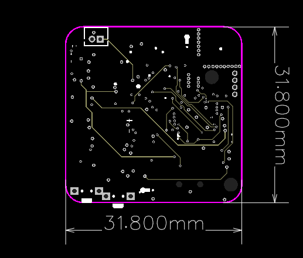
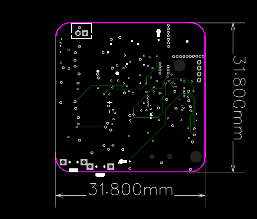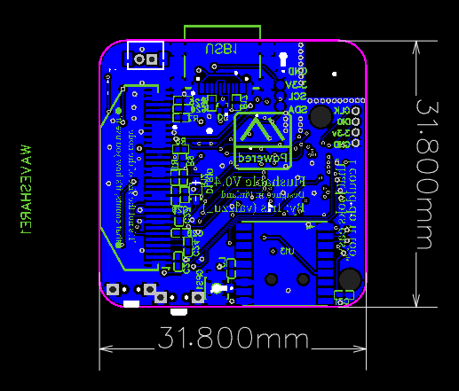

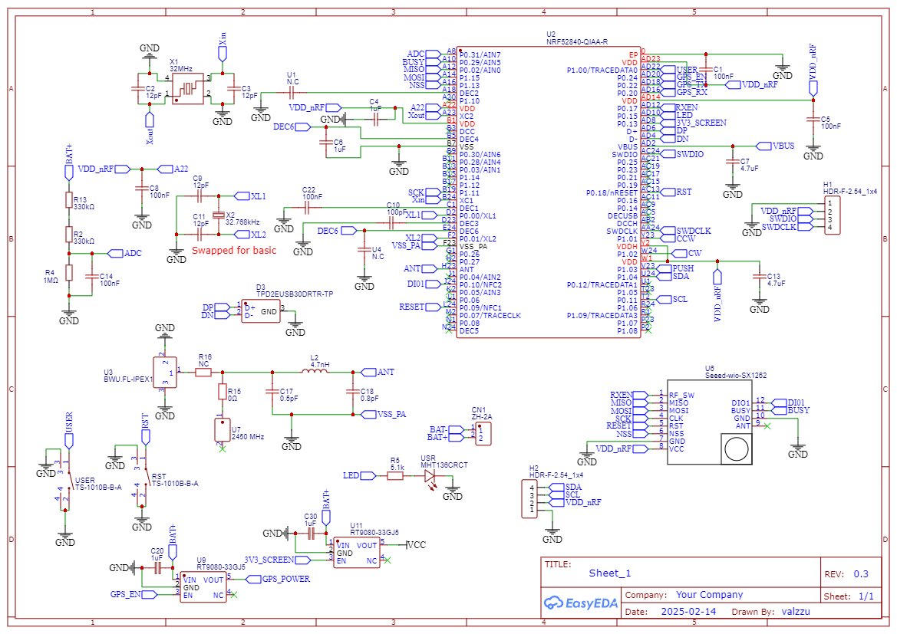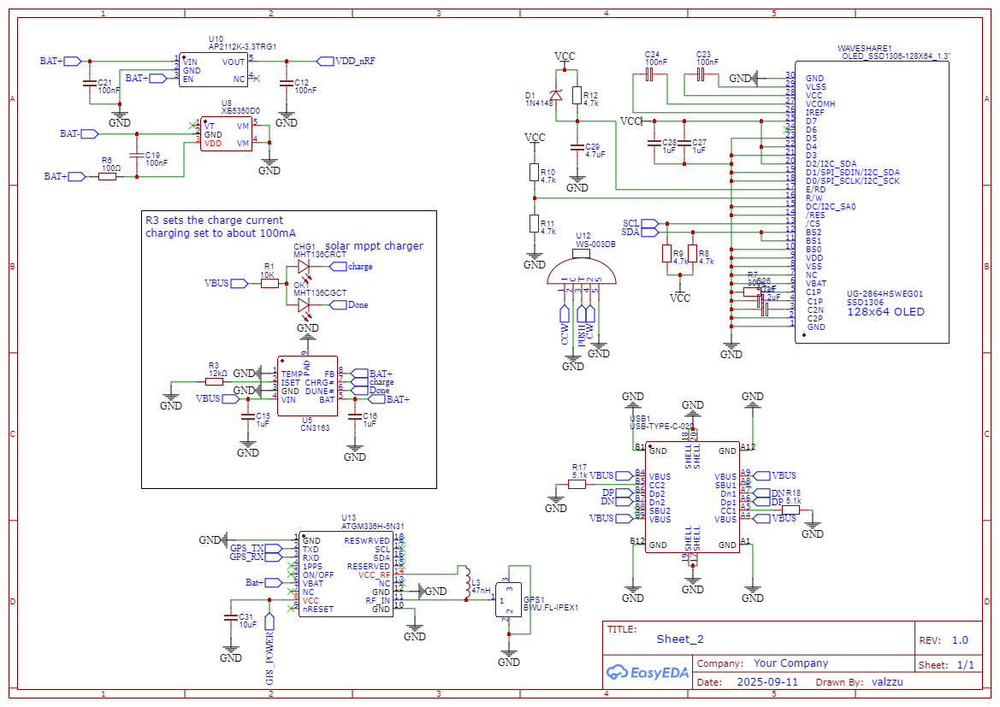

[Gerber](./V0.4/Gerber_nRF52-watch.zip)

[BOM](./V0.4/BOM_nRF52-watch.csv)

[PnP](./V0.4/PickAndPlace_nRF52-watch.csv)
