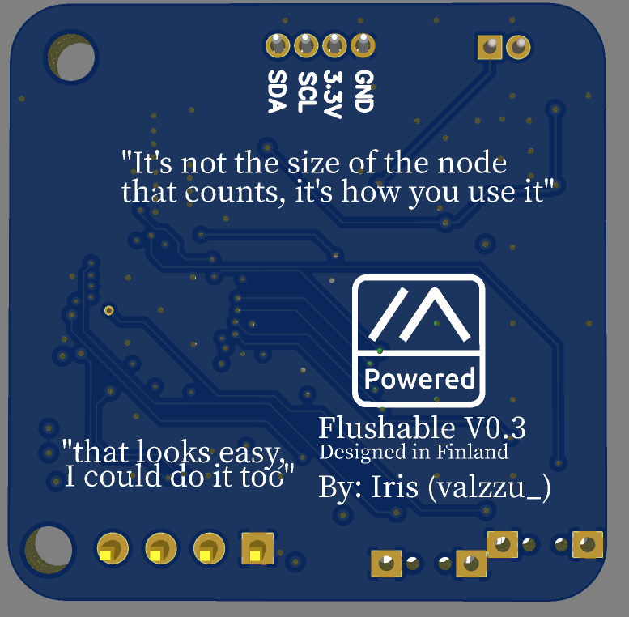

### Flushable

Both lora and ble has ipex ufl connector

[Lora](https://www.seeedstudio.com/Wio-SX1262-Wireless-Module-p-5981.html)

[Gerber](./Gerber_nRF52-watch.zip)

[BOM](./BOM_nRF52-watch.csv)

[PnP](./PickAndPlace_nRF52-watch.csv)

## V0.4.X

> [!CAUTION]
> V0.4 has not been tested yet so no quarantee everything works

[Gerber](./V0.4/Gerber_nRF52-watch.zip)

[BOM](./V0.4/BOM_nRF52-watch.csv)

[PnP](./V0.4/PickAndPlace_nRF52-watch.csv)
