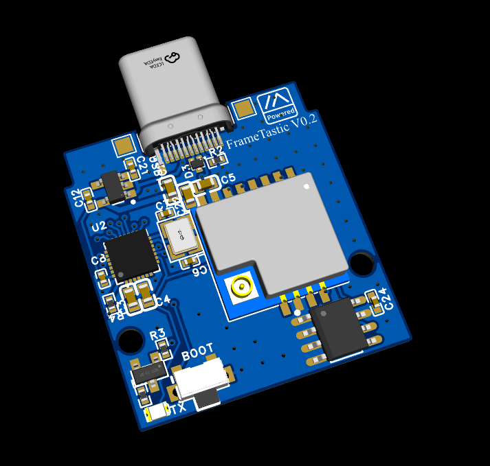
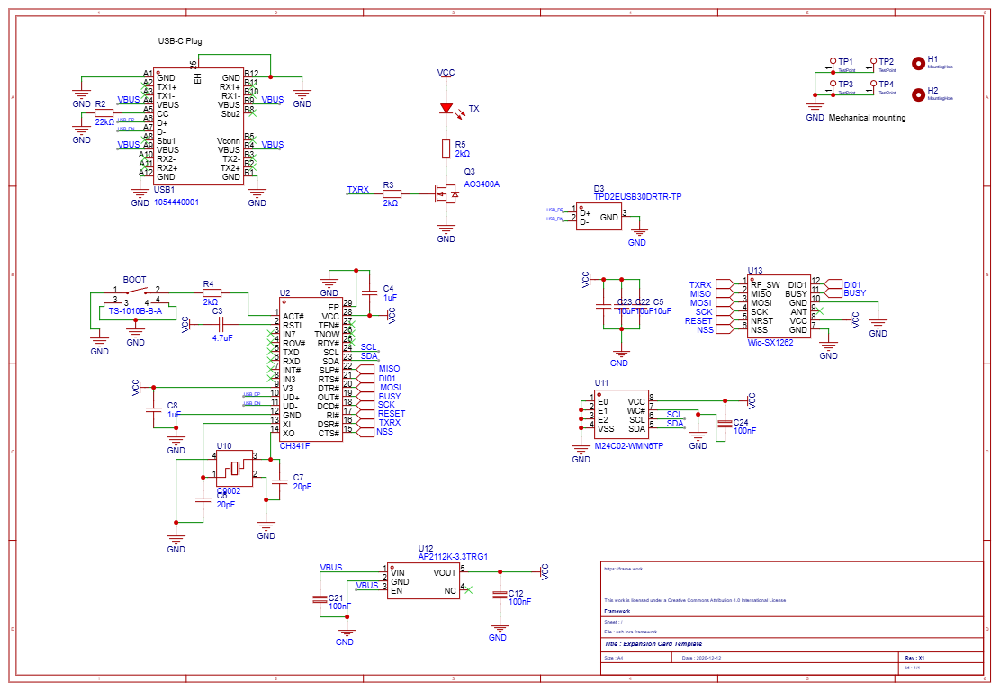

# Licence 

This work is licensed under the [Creative Commons Attribution-NonCommercial-NoDerivatives 4.0 International License (CC BY-NC-ND 4.0)](https://creativecommons.org/licenses/by-nc-nd/4.0/).

### Usage Terms

The license terms are negotiable. You are free to use this work for non-commercial purposes without profit. If you receive compensation or profit from its use, please consider supporting me through [GitHub Sponsors](https://github.com/sponsors/valzzu).

# FrameTastic

> [!CAUTION]
> Has not been yet verified to work
>
> will update with more information once available

The enclousure will be made once i get the boards so i can test fit them.

