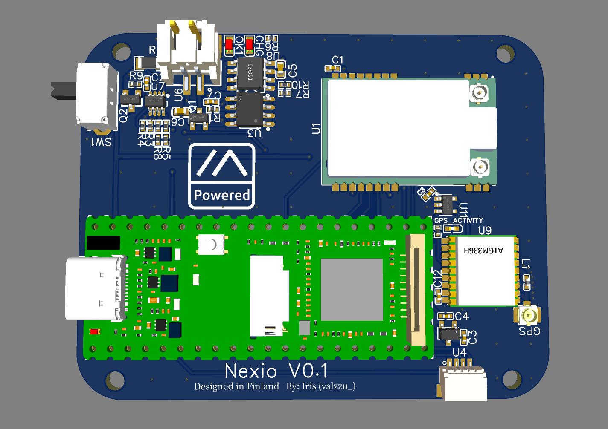
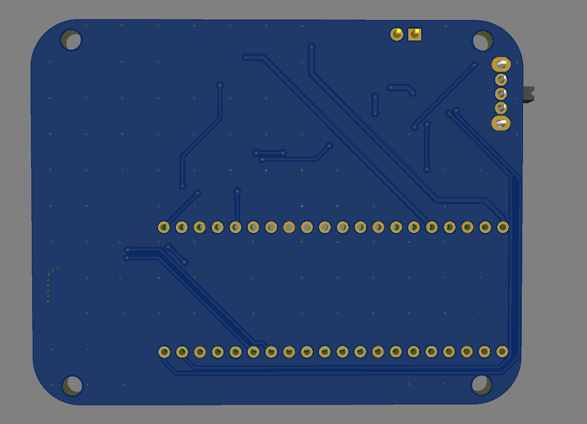
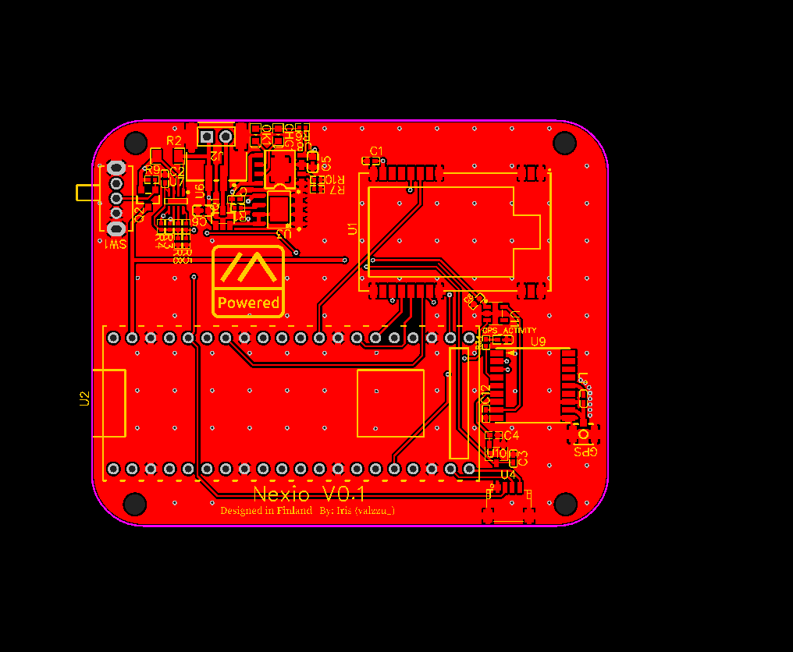
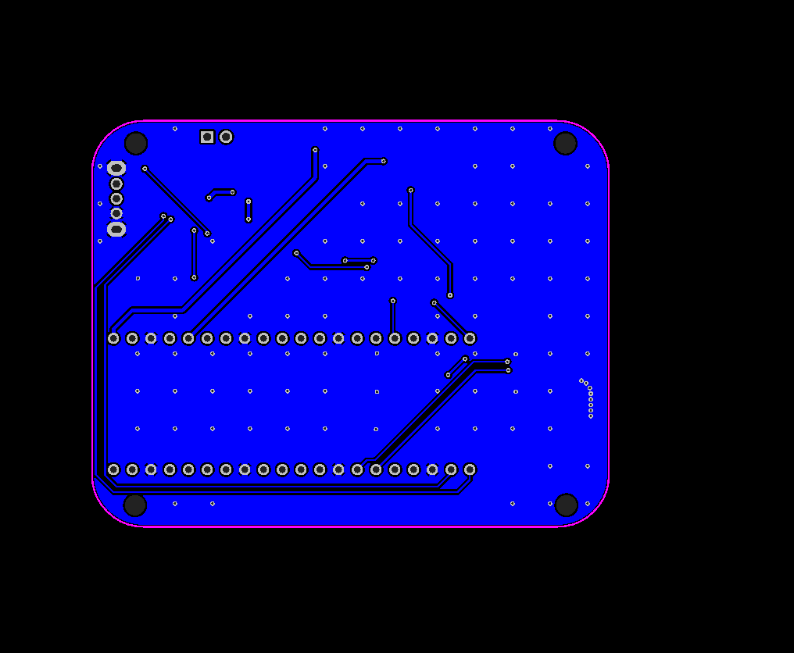
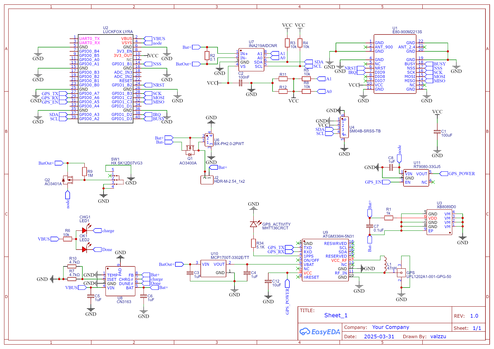

# Nexio

Nexio is linux powered node based on Luckfox Lyra paired with E80-900M2213S
PCB attaches behind [this](https://vi.aliexpress.com/item/1005006975542555.html) touchscreen

> [!CAUTION]
> this has not been tested so order it at ur own risk!
>
> plus theres no linux distro yet

[Luckfox Lyra](https://www.luckfox.com/Luckfox-Lyra)

[Gerber](./Gerber_Nexio.zip)

[BOM](./BOM_Nexio.csv)

[PnP](./PickAndPlace_Nexio.csv)

## Features

- INA219 Voltage and Current sesnor
- XB8089D0 Battey protection IC
- CN3162 for chargin
- ATGM336H-5N31 for onboard gps
