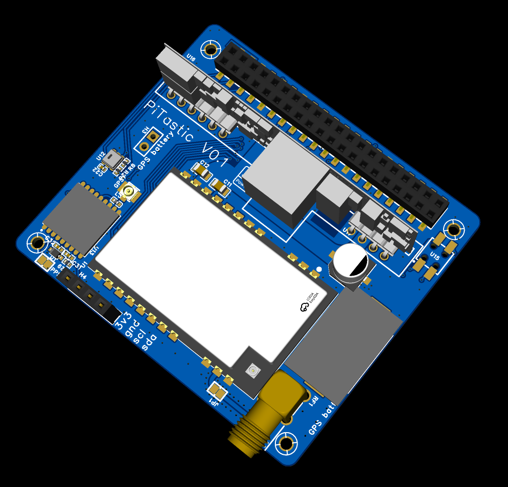
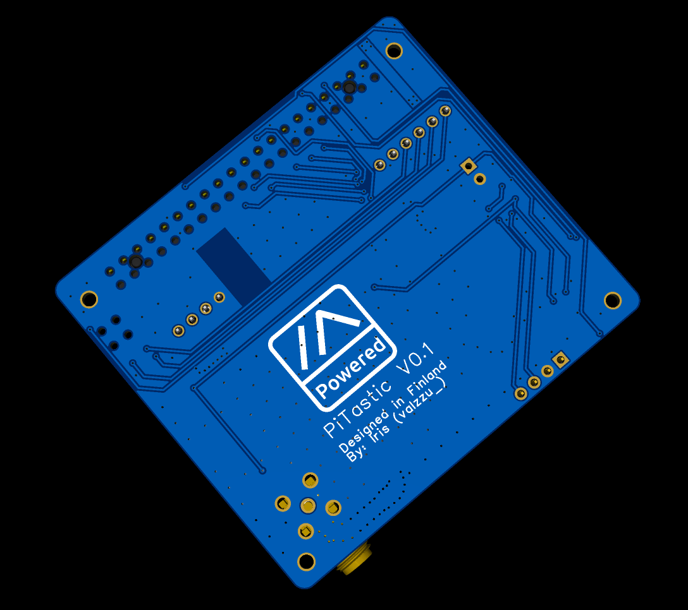
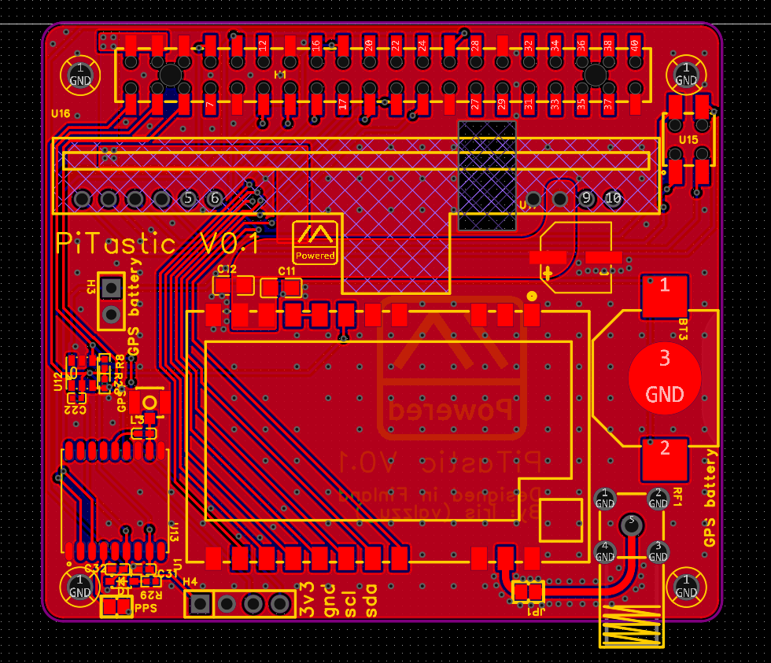
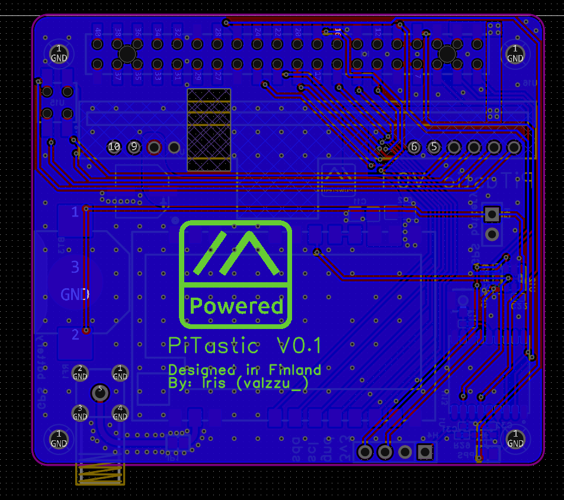
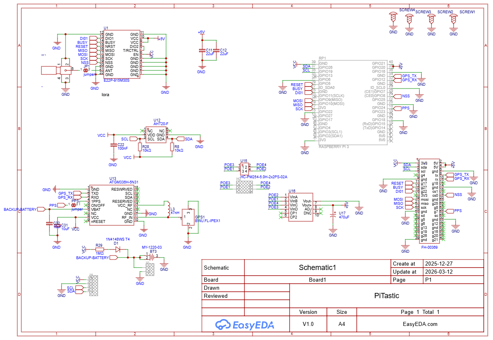

# Licence 

This work is licensed under the [Creative Commons Attribution-NonCommercial-NoDerivatives 4.0 International License (CC BY-NC-ND 4.0)](https://creativecommons.org/licenses/by-nc-nd/4.0/).

### Usage Terms

The license terms are negotiable. You are free to use this work for non-commercial purposes without profit. If you receive compensation or profit from its use, please consider supporting me through [GitHub Sponsors](https://github.com/sponsors/valzzu).

# PiTastic

> [!WARNING]
> Lora has been tested, POE not yet.
> AHT-20 is detected by linux but not meshtasticd
> GPS maybe works, havent tested it yet.

Optional [POE module](https://eu.mouser.com/ProductDetail/Silvertel/Ag97005-FL?qs=jcD%2FCkGBYeP9k9cGX%252B5wng%3D%3D)

Recommended [module](https://www.mouser.com/ProductDetail/Silvertel/AG5405?qs=stqOd1AaK79%2Fxd5F96tfEA%3D%3D) but it reguires extermal components that this board does not have at this time. So this module wont work as supposed to untill i make it support it.
