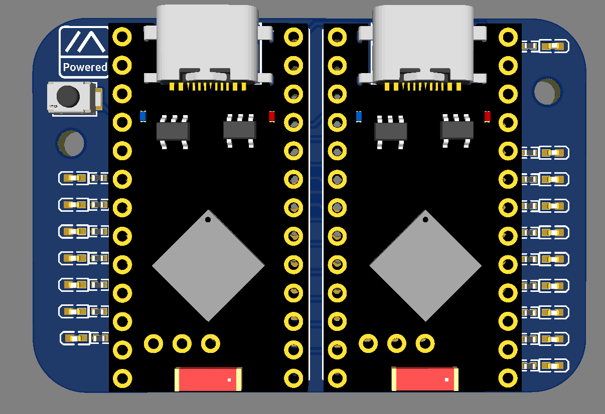
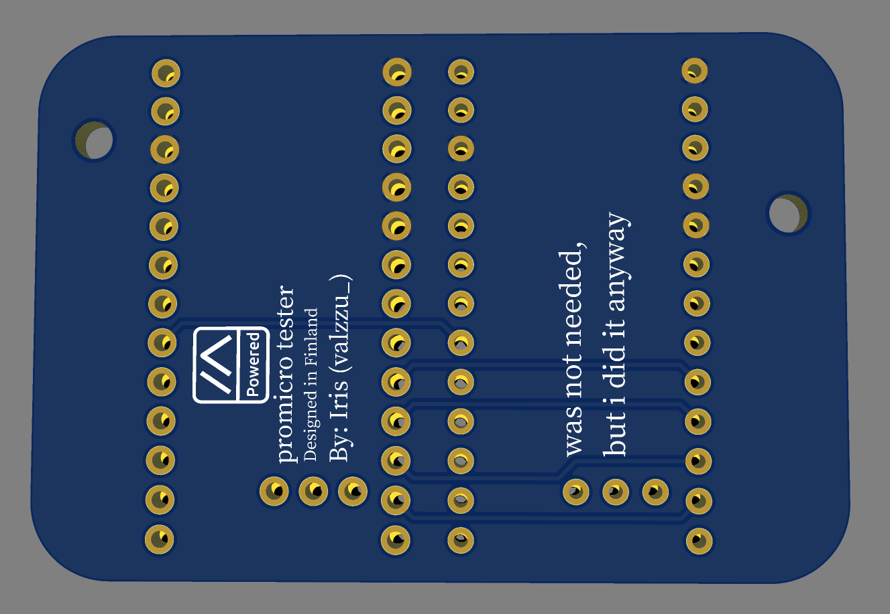
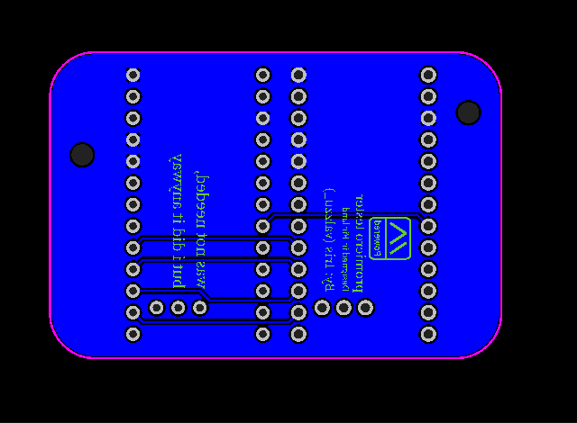

# Promicro Testing board

The board only has all the relevant pins hooked up to leds that are used with meshtastic by default.

You can either test with the pogo pins if the promicro doesen't have headers.

> [!CAUTION]
> The board has not been tested

[Gerber](./Gerber_promicro_tester.zip)

[BOM](./BOM_promicro_tester.csv)

[PnP](./PickAndPlace_promicro_tester.csv)

Additionally, u need [pin headers](https://www.aliexpress.com/item/1005005666298784.html)

and

[test pins](https://www.aliexpress.com/item/32948963610.html)

thx to [ICantMakeThings](https://github.com/ICantMakeThings/Nicenano-NRF52-Supermini-PlatformIO-Support) for their example NRF52 supermini platformio repo

[Firmware](./firmware.uf2) Flash at ur own risk :)

[Firmware Source](./firmware_source)

[3D printable case]() soon :)
