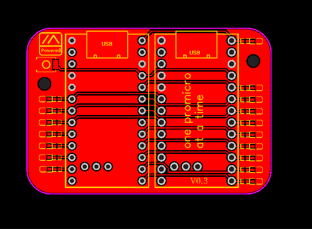
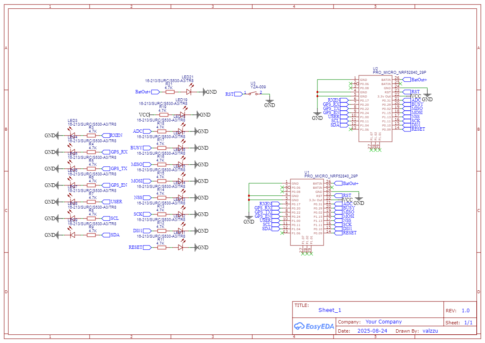

# Promicro Testing board

Board only has all the relevant pins hooked up to leds that are used with meshtastic by default.

> [!CAUTION]
> Board has not been tested

[Gerber](./Gerber_promicro_tester.zip)

[BOM](./BOM_promicro_tester.csv)

[PnP](./PickAndPlace_promicro_tester.csv)
