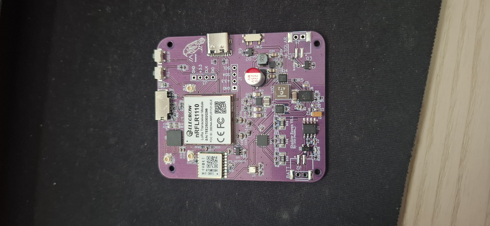
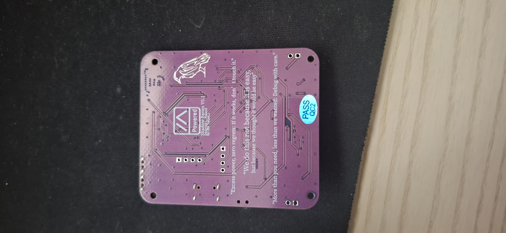
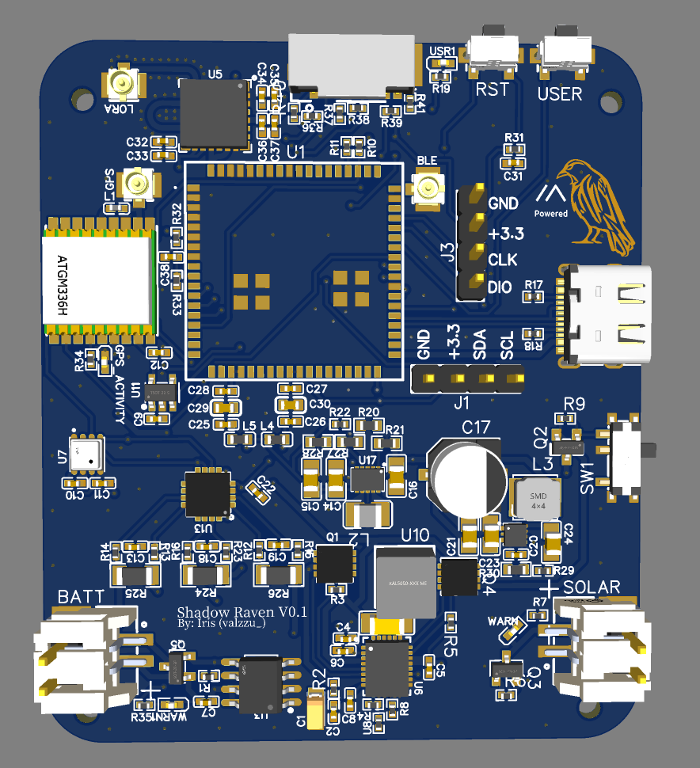
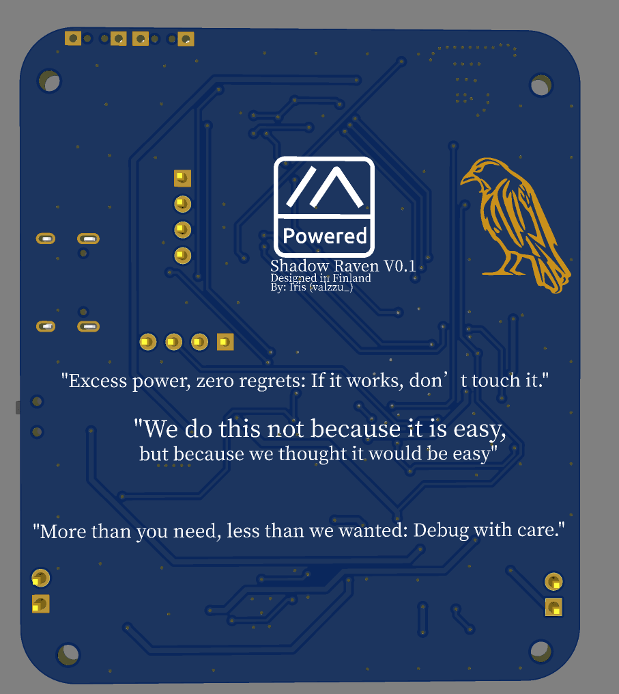
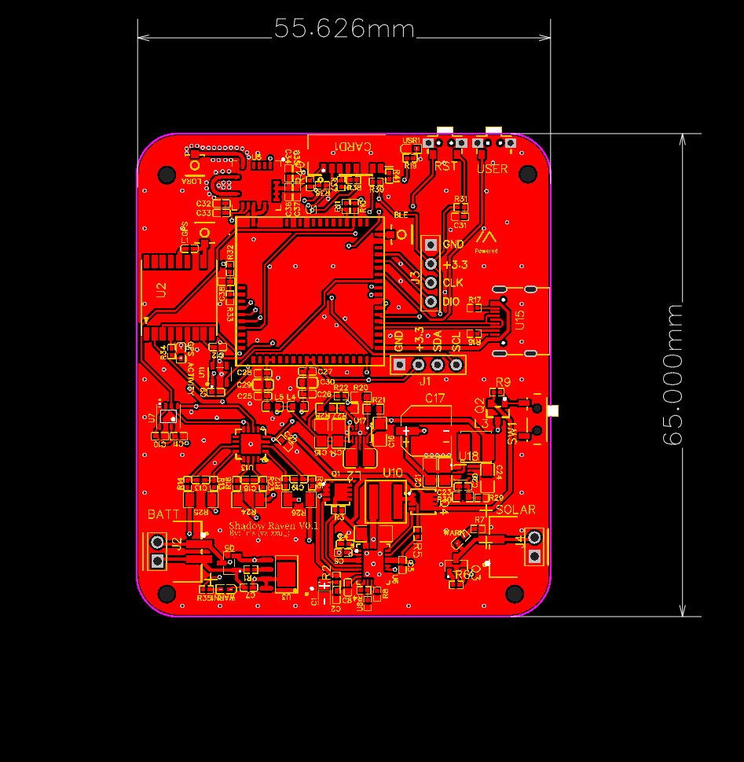
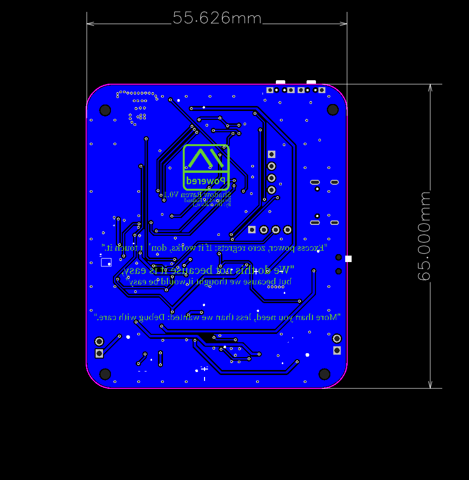
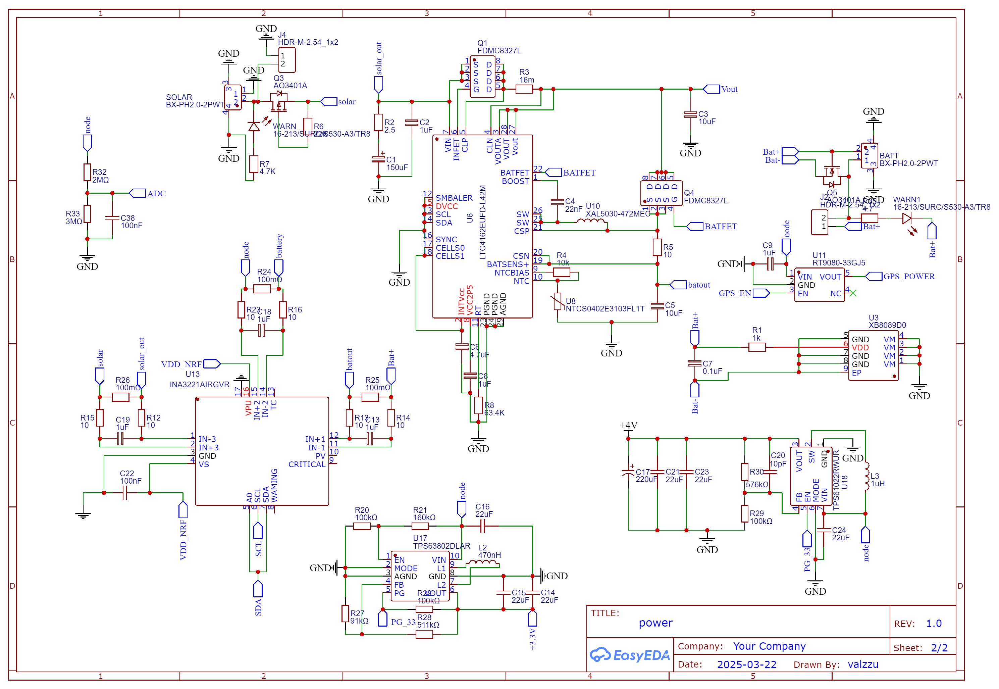

# Licence 

This work is licensed under the Creative Commons Attribution-NonCommercial-NoDerivatives 4.0 International License (CC BY-NC-ND 4.0).

### Usage Terms

The license terms are negotiable. You are free to use this work for non-commercial purposes without profit. If you receive compensation or profit from its use, please consider supporting me through GitHub Sponsors.

# Shadow Raven

> [!CAUTION]
> DO NOT ORDER!!!! non functional on some parts.

What is this?
this is a node made for elecrows free pcb promotion.

not tested yet but i have sent the files to elecrow

This is not a cheap board either, about 200€ in jlcpcb for 5 boards.

main things in this board are:
- Elecrow nRFLR1110
- ATGM336H-5N
- BME680
- SD Card slot
- SKY65313-21
- INA3221
- LTC4162EUFD-L42M
- XB8089D0

