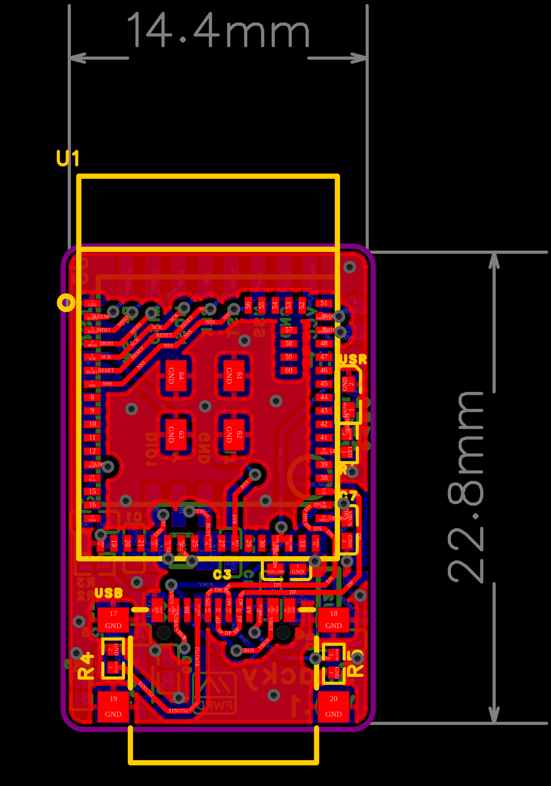
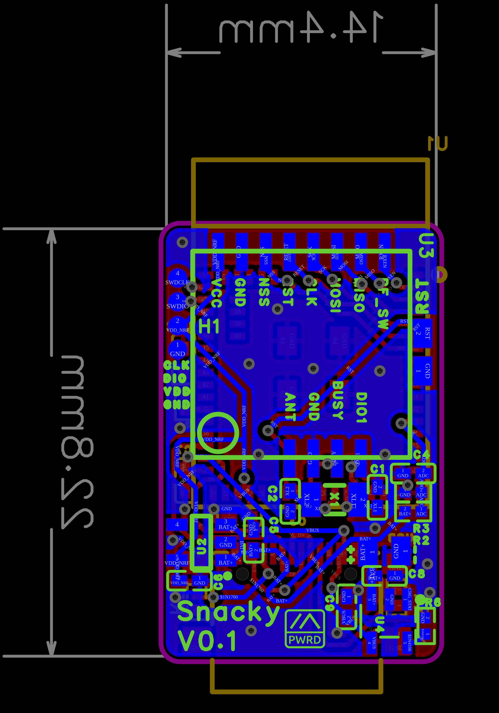
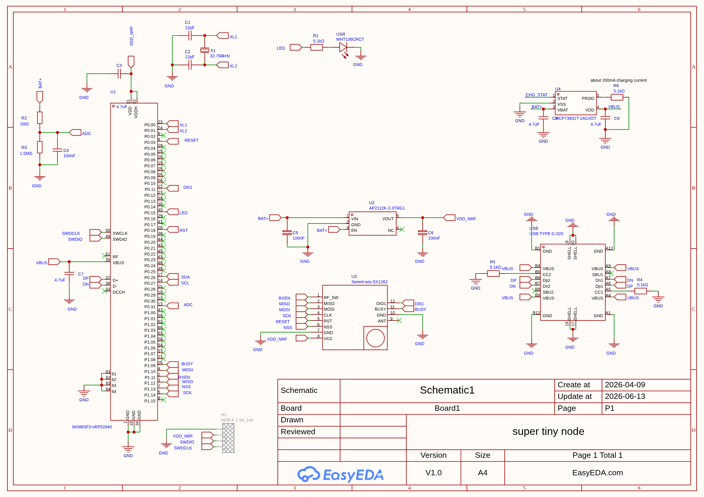

# Licence 

This work is licensed under the [Creative Commons Attribution-NonCommercial-NoDerivatives 4.0 International License (CC BY-NC-ND 4.0)](https://creativecommons.org/licenses/by-nc-nd/4.0/).

### Usage Terms

The license terms are negotiable. You are free to use this work for non-commercial purposes without profit. If you receive compensation or profit from its use, please consider supporting me through [GitHub Sponsors](https://github.com/sponsors/valzzu).

# Snacky

My tiniest node so far i think at 14.4x22.8mm

> [!CAUTION]
> Has not been yet verified to work
>
> will update with more information once available

[Lora module](https://www.seeedstudio.com/Wio-SX1262-Wireless-Module-p-5981.html)

[nrf52 module](https://store.minewsemi.com/product/bluetooth-modules-nrf52840-ms88sf31/)

[BOM](./BOM_Snacky.csv)

[PnP](./PickAndPlace_Snacky.csv)

[Gerber](./Gerber_Snacky.zip)

