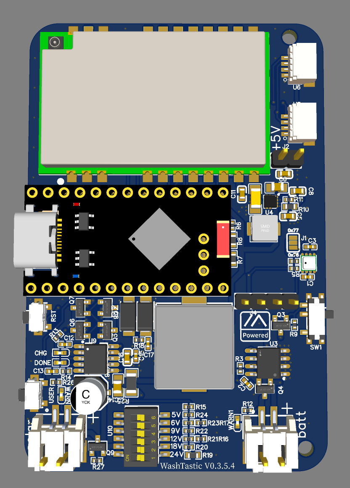
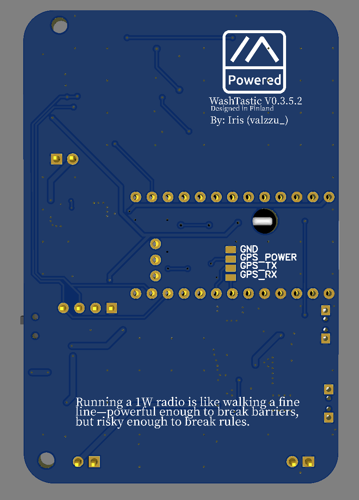
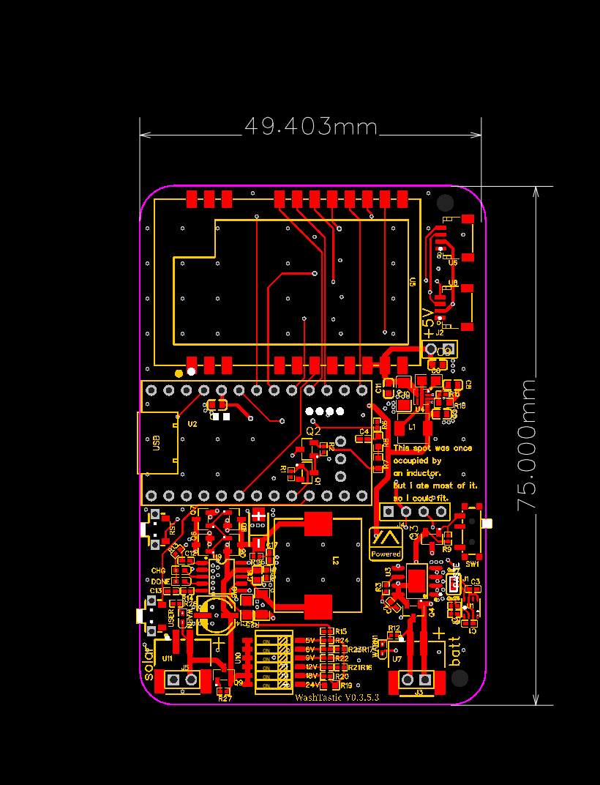
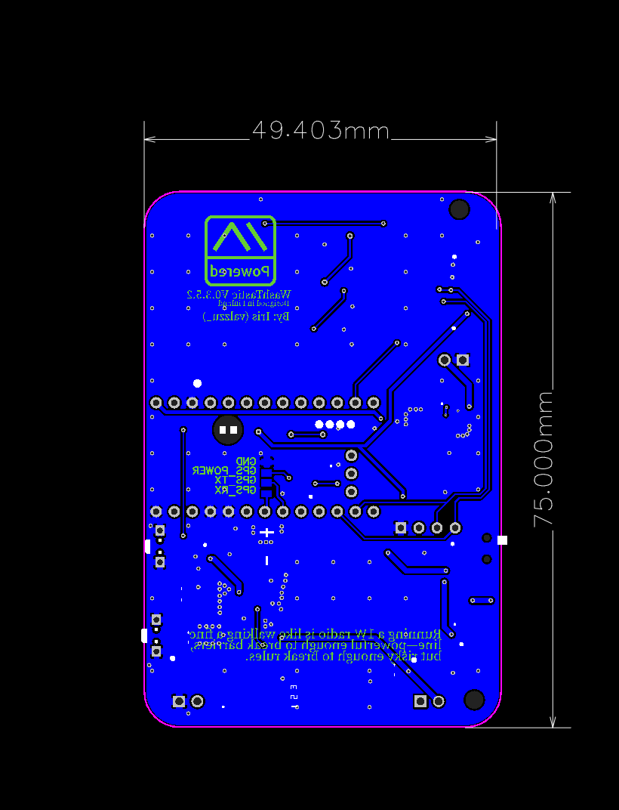

# Licence 

This work is licensed under the [Creative Commons Attribution-NonCommercial-NoDerivatives 4.0 International License (CC BY-NC-ND 4.0)](https://creativecommons.org/licenses/by-nc-nd/4.0/).

### Usage Terms

The license terms are negotiable. You are free to use this work for non-commercial purposes without profit. If you receive compensation or profit from its use, please consider supporting me through [GitHub Sponsors](https://github.com/sponsors/valzzu).

# WashTastic

 

Dont want to assemble these by you're self?

U can now buy ready to go device from Elecrow

https://www.elecrow.com/washtastic-nrf52-powered-and-solar-ready.html

or if in the EU u can buy from me if i have some in stock

https://valzzu.etsy.com

(remember to update firmware (: )

if ordering from jlcpcb or pcbway the only component u need to get is promicro nrf52

U can get firmware for this from here https://mrekin.duckdns.org/flasher/ for now.

### power consumption

I used an ina3221 to measure the current usage over an hour and it came to about 20mAh. so by that calculations its using about 480mAh per day. (old information, needs to be re-measured.)

If u have better and real world data i will happily accept them :)

### firmware

U need to flash the promicro with promicro diy Variant from the flasher.

U might need to update the bootloader of the promicro to get it to accept the firmware.

If it doesent have a bootloader check [here](https://github.com/gargomoma/fakeTec_pcb?tab=readme-ov-file#my-promicro-is-dead-what-can-i-do)

## V0.3.5

the only major change in this version is the solar charging ic is changed to CN3791.

Tested to be working :)

U should connect a battery when using, this is not meant to run on solar only.

It has input range of 4.5-28V.

If you live in EU country u can order one from [here](https://www.etsy.com/fi-en/listing/4323773321/washtastic-nrf52-powered-and-solar-ready)

JLCPCB is saying that the part is not selected nor does it allow to choose a replacement part, if that happens this is the part
[XR1365-680M](https://www.lcsc.com/product-detail/Power-Inductors_XR-XR1365-680M_C41384054.html?s_z=n_C41384054)
JLCPCB doesen't seem to have this part at all, rather it finds this part that is no where what the original was.
[XR1265-680M](https://jlcpcb.com/partdetail/Xr-XR1265680M/C5339474)

[promicro NRF52840](https://vi.aliexpress.com/item/1005007040333351.html)

[Gerber](./V0.3.5/Gerber_1W-meshtastic-node_0.3.5.zip)

[BOM](./V0.3.5/BOM_1W-meshtastic-node_0.3.5.csv)

[PnP](./V0.3.5/PickAndPlace_PCB_1W-meshtastic-node-0.3.5.csv)

## V0.4.X

> [!WARNING]
> V0.4 has been tested and it seems to work but order at ur own risk.

In v0.4 nrf52840 is directly integrated on the pcb along with ina3221.
So no need to buy promicros.
In theory, it should just work but who knows 😅

I also added pins for gps since there was space.
plus the PCB is now 4 layers and there are very tiny vias so there's a possibility of extra charge.

u may also need to flash the nrf52 chip with a bootloader.

u can use this [clamp - 1.27mm single row 4P](https://www.aliexpress.com/item/1005004869027755.html) for programming the board without needing to solder wires.

[Gerber v0.4](./V0.4/Gerber_1W-meshtastic-node_PCB_1W-meshtastic-node-0.4.zip)

[BOM v0.4 with connectors](./V0.4/BOM_1W-meshtastic-node_0.4_connectors.csv)

or

[BOM v0.4 without connectors](./V0.4/BOM_1W-meshtastic-node_0.4_no-connectors.csv)

[PnP v0.4](./V0.4/PickAndPlace_PCB_WashTastic-1W-meshtastic-node_V0.4.csv)
