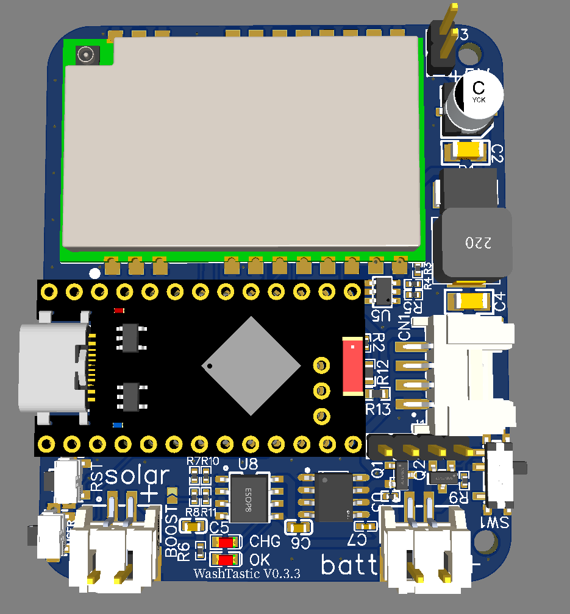
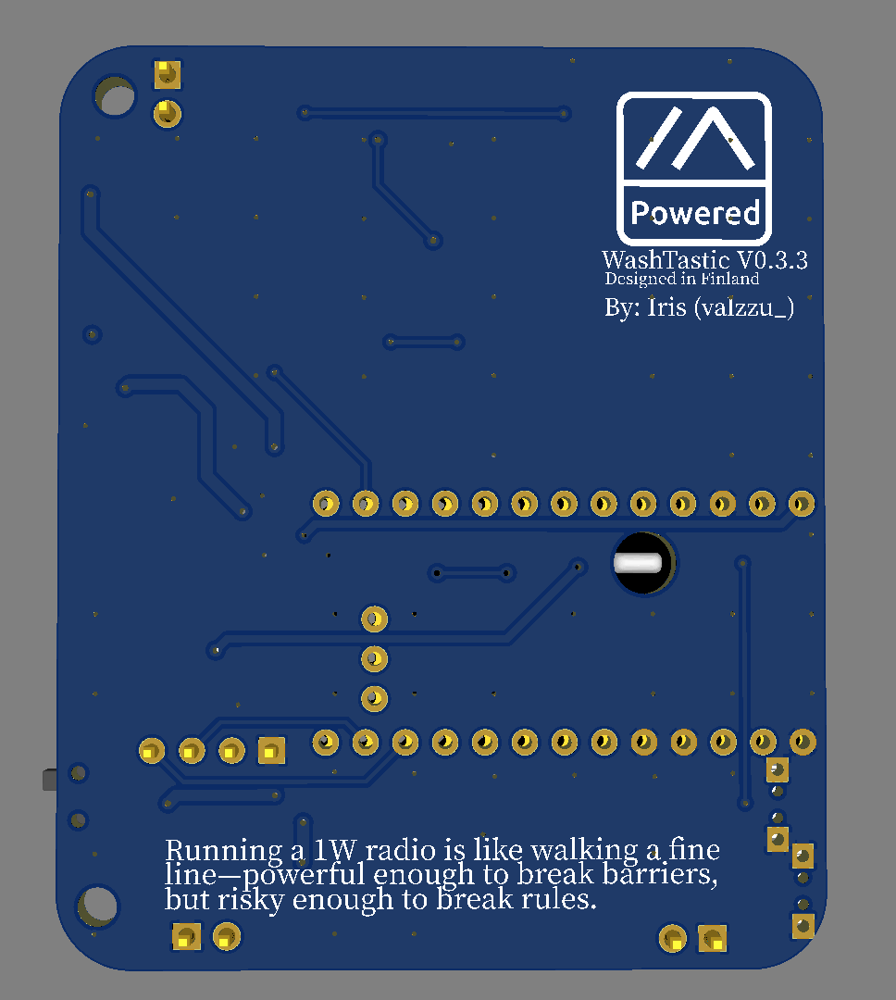
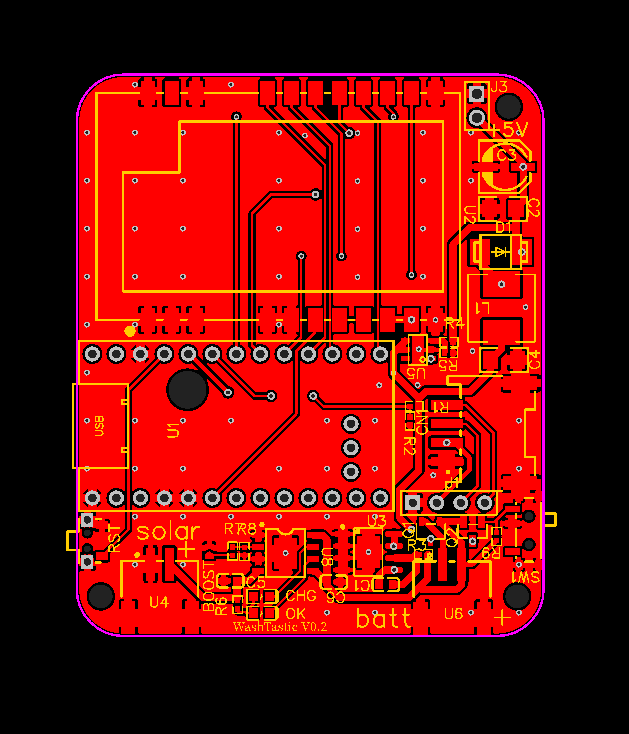
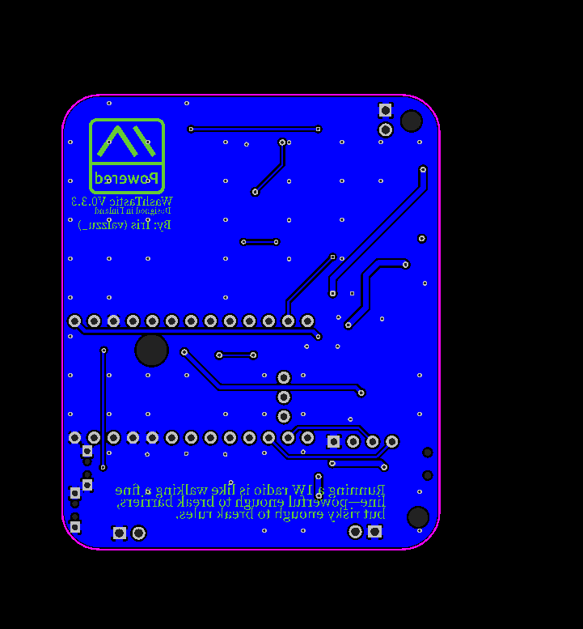
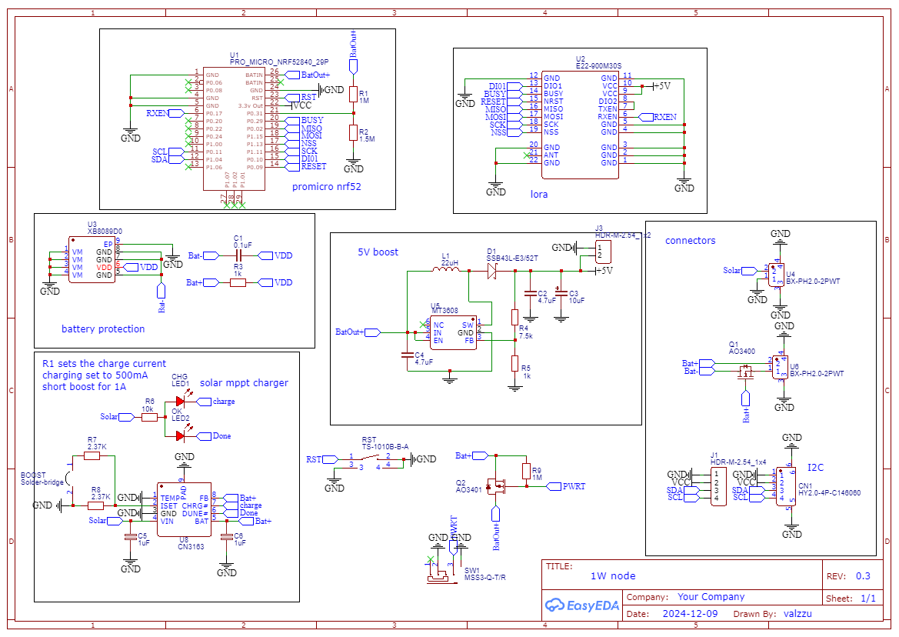
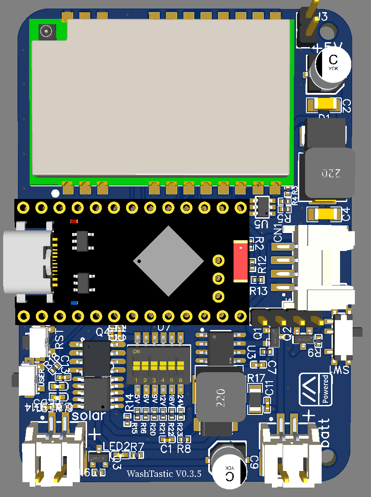
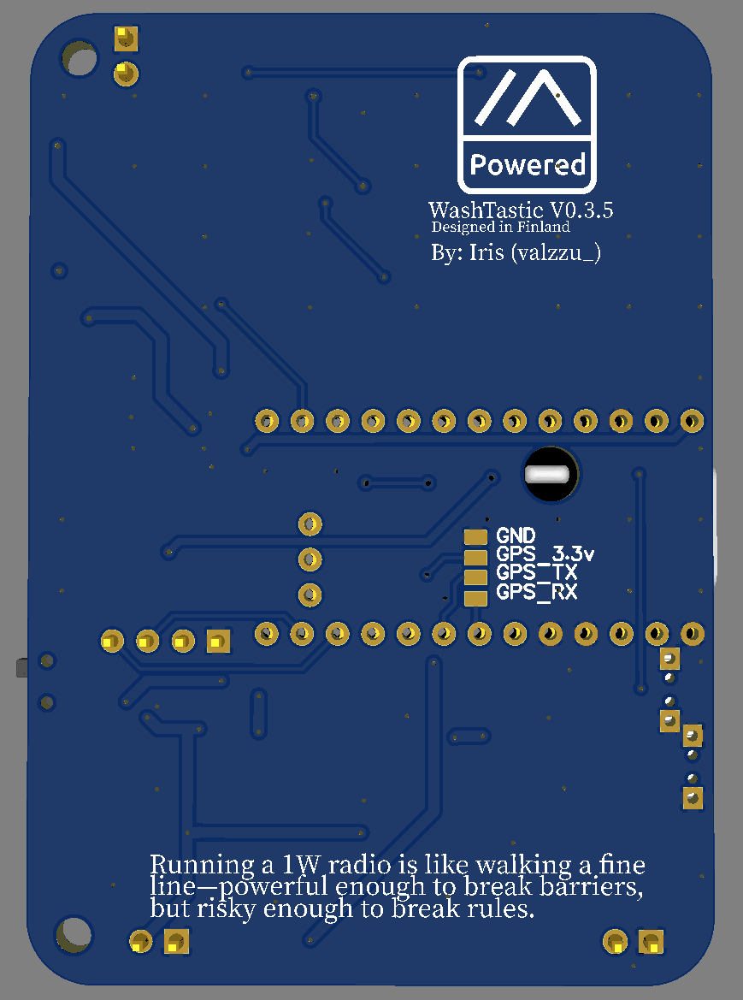
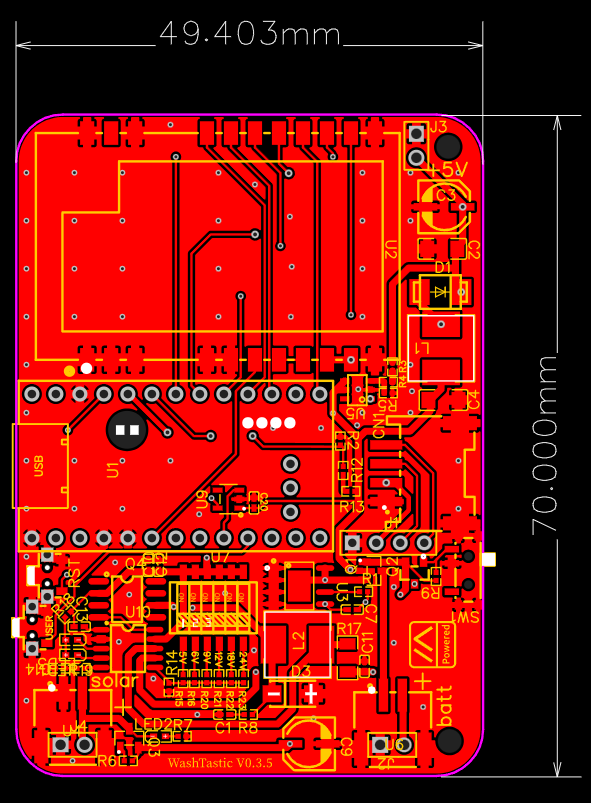

# WashTastic

 

Make sure these components are oriented like the image shows :)
To rotate first left click then right click and rotate

if ordering from jlcpcb or pcbway the only component u need to get is promicro nrf52

### power consumption

I used an ina3221 to measure the current usage over an hour and it came to about 20mAh. so by that calculations its using about 480mAh per day.

If u have better and real world data i will happily accept them :)

### firmware

U need to flash the promicro with promicro diy Variant from the flasher.

U might need to update the bootloader of the promicro to get it to accept the firmware.

If it doesent have a bootloader check [here](https://github.com/gargomoma/fakeTec_pcb?tab=readme-ov-file#my-promicro-is-dead-what-can-i-do)

### stuff u need

[promicro NRF52840](https://vi.aliexpress.com/item/1005007040333351.html)

[Gerber](./Gerber_1W-meshtastic-node_PCB_1W-meshtastic-node-0.3.3b.zip)

[BOM with connectors](./BOM_1W-meshtastic-node_0.3.3_connectors.csv)

or

[BOM without connectors](./BOM_1W-meshtastic-node_0.3.3_no-connectors.csv)

[PnP](./PickAndPlace_PCB_1W-meshtastic-node-0.3.3.csv)

## V0.3.5

the only major change in this version is the solar chargin ic is changed to CN3791.

It has input range of 4.5-28V.

[promicro NRF52840](https://vi.aliexpress.com/item/1005007040333351.html)

[Gerber](./Gerber_1W-meshtastic-node_PCB_1W-meshtastic-node-0.3.5.zip)

[BOM with connectors](./BOM_1W-meshtastic-node_0.3.5_connectors.csv)

or

[BOM without connectors](./BOM_1W-meshtastic-node_0.3.5_no-connectors.csv)

[PnP](./PickAndPlace_PCB_1W-meshtastic-node-0.3.5.csv)

> [!CAUTION]
> V0.4 has not been tested so order it at ur own risk!

In v0.4 nrf52840 is directly integrated on the pcb along with ina3221.
So no need to buy promicros.
In theory, it should just work but who knows 😅

I also added pins for gps since there was space.
plus the PCB is now 4 layers and there are very tiny vias so there's a possibility of extra charge.

u may also need to flash the nrf52 chip with a bootloader.

[Gerber v0.4](./Gerber_1W-meshtastic-node_PCB_1W-meshtastic-node-0.4.zip)

[BOM v0.4 with connectors](./BOM_1W-meshtastic-node_0.4_connectors.csv)

or

[BOM v0.4 without connectors](./BOM_1W-meshtastic-node_0.4_no-connectors.csv)

[PnP v0.4](./PickAndPlace_PCB_WashTastic-1W-meshtastic-node_V0.4.csv)

# To-do

- [x] add ina if possible

- [x] uart pads for gps

- [ ] groove on the bottom of the pcb

- [x] through holes for power?

- [x] increase 5v boost to 5.5v?
